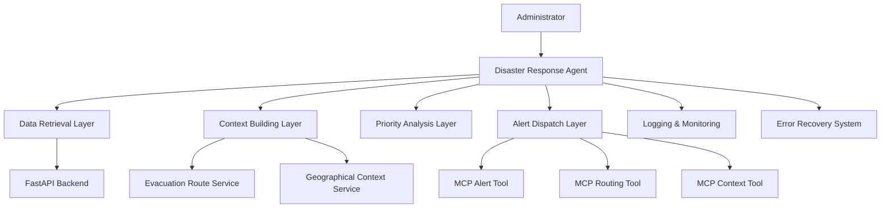

# Design Document: Agentic Disaster Response Flow

## Overview

The Agentic Disaster Response Flow is a sophisticated autonomous system that orchestrates disaster response activities through intelligent decision-making and coordinated action execution. The system integrates with the existing evacuation route finding capabilities and extends them with autonomous agent-based processing, contextual analysis, and multi-channel alert dispatch through MCP tools.

The architecture follows an event-driven, microservices-inspired design where each component has clear responsibilities and interfaces. The system prioritizes resilience, scalability, and real-time responsiveness to handle critical disaster scenarios effectively.

## Architecture

The system employs a layered architecture with clear separation of concerns:



**Layer Responsibilities:**

- **Agent Orchestration Layer**: Coordinates the entire workflow and manages state
- **Data Retrieval Layer**: Interfaces with FastAPI backend and external data sources
- **Context Building Layer**: Enriches disaster data with geographical and situational context
- **Priority Analysis Layer**: Analyzes context to determine alert priorities and urgency
- **Alert Dispatch Layer**: Executes alert delivery through appropriate MCP tools

## Components and Interfaces

### Disaster Response Agent (`DisasterResponseAgent`)

The central orchestrator that manages the complete disaster response workflow.

**Key Methods:**

- `process_disaster_event(disaster_id: str) -> DisasterResponse`
- `handle_concurrent_disasters(disaster_ids: List[str]) -> List[DisasterResponse]`
- `recover_from_failure(failure_context: FailureContext) -> RecoveryResult`

**State Management:**

- Maintains active disaster registry
- Tracks workflow progress for each disaster
- Manages resource allocation and prioritization

### Context Builder (`ContextBuilder`)

Responsible for enriching disaster data with comprehensive contextual information.

**Key Methods:**

- `build_context(disaster_data: DisasterData) -> StructuredContext`
- `enrich_geographical_context(location: Location) -> GeographicalContext`
- `integrate_evacuation_routes(context: StructuredContext) -> EnrichedContext`

**Data Structures:**

```python
@dataclass
class StructuredContext:
    disaster_info: DisasterInfo
    geographical_context: GeographicalContext
    evacuation_routes: List[EvacuationRoute]
    affected_population: PopulationData
    available_resources: ResourceInventory
    risk_assessment: RiskMetrics
```

### Alert Prioritizer (`AlertPrioritizer`)

Analyzes contextual data to determine appropriate alert priorities using established emergency management algorithms.

**Priority Levels:**

- **CRITICAL**: Immediate life-threatening situations requiring instant response
- **HIGH**: Serious situations requiring rapid response within minutes
- **MEDIUM**: Important situations requiring response within hours
- **LOW**: Non-urgent situations for routine processing

**Key Methods:**

- `analyze_priority(context: StructuredContext) -> AlertPriority`
- `calculate_risk_score(context: StructuredContext) -> float`
- `rank_concurrent_disasters(contexts: List[StructuredContext]) -> List[RankedDisaster]`

**Priority Algorithm:**
The system uses a weighted scoring algorithm based on:

- Affected population size (40% weight)
- Geographical scope and accessibility (25% weight)
- Available evacuation routes and capacity (20% weight)
- Time sensitivity and disaster type (15% weight)

### Alert Dispatcher (`AlertDispatcher`)

Manages alert delivery through MCP tools with intelligent routing and fallback mechanisms.

**Key Methods:**

- `dispatch_alerts(priority: AlertPriority, context: StructuredContext) -> DispatchResult`
- `select_mcp_tools(priority: AlertPriority) -> List[MCPTool]`
- `execute_with_fallback(tools: List[MCPTool], alert_data: AlertData) -> ExecutionResult`

**MCP Tool Integration:**

- **Alert MCP Tool**: Handles notification delivery to various channels
- **Routing MCP Tool**: Manages evacuation route dissemination
- **Context MCP Tool**: Provides situational awareness data to responders

## Data Models

### Core Data Structures

```python
@dataclass
class DisasterData:
    disaster_id: str
    disaster_type: DisasterType
    location: Location
    severity: SeverityLevel
    timestamp: datetime
    affected_areas: List[GeographicalArea]
    estimated_impact: ImpactAssessment

@dataclass
class Location:
    latitude: float
    longitude: float
    address: Optional[str]
    administrative_area: str

@dataclass
class AlertPriority:
    level: PriorityLevel
    score: float
    reasoning: str
    estimated_response_time: timedelta
    required_resources: List[ResourceType]

@dataclass
class DisasterResponse:
    disaster_id: str
    processing_status: ProcessingStatus
    context: StructuredContext
    priority: AlertPriority
    dispatch_results: List[DispatchResult]
    completion_time: datetime
    errors: List[ErrorRecord]
```

### Integration Models

```python
@dataclass
class MCPToolConfig:
    tool_name: str
    endpoint: str
    priority_mapping: Dict[PriorityLevel, ToolConfiguration]
    fallback_tools: List[str]
    timeout_seconds: int

@dataclass
class EvacuationRoute:
    route_id: str
    start_location: Location
    end_location: Location
    distance_km: float
    estimated_time_minutes: int
    capacity: int
    current_load: int
    route_geometry: List[Coordinate]
```

## Correctness Properties

_A property is a characteristic or behavior that should hold true across all valid executions of a system-essentially, a formal statement about what the system should do. Properties serve as the bridge between human-readable specifications and machine-verifiable correctness guarantees._

Based on the prework analysis, all acceptance criteria are testable as properties. After reviewing for redundancy, I've consolidated related properties to avoid duplication while maintaining comprehensive coverage:

### Data Processing Properties

**Property 1: FastAPI Integration Consistency**
_For any_ disaster event trigger, the Disaster Response Agent should successfully retrieve disaster data from the FastAPI backend and validate its completeness and format
**Validates: Requirements 1.1, 1.2**

**Property 2: Invalid Data Handling**
_For any_ invalid or incomplete disaster data, the agent should log detailed error information and request data correction while preventing further processing
**Validates: Requirements 1.3**

**Property 3: Workflow Progression**
_For any_ valid disaster data, the agent should initiate the context building process and progress through the complete workflow to alert dispatch
**Validates: Requirements 1.4, 5.2**

### Context Building Properties

**Property 4: Context Enrichment Completeness**
_For any_ disaster data, the Context Builder should enrich it with geographical context, integrate evacuation route information, and structure the result in a standardized format
**Validates: Requirements 2.1, 2.2, 2.3**

**Property 5: Partial Context Handling**
_For any_ context building failure, the system should provide partial context with clear indicators of missing information and validate complete contexts before proceeding
**Validates: Requirements 2.4, 2.5**

### Priority Analysis Properties

**Property 6: Priority Analysis Consistency**
_For any_ structured context, the Alert Prioritizer should analyze severity indicators considering affected population, geographical scope, and evacuation routes, then assign a valid priority level (Critical, High, Medium, Low)
**Validates: Requirements 3.1, 3.2, 3.3**

**Property 7: Multi-Disaster Ranking**
_For any_ set of concurrent disasters, the Alert Prioritizer should rank them by comparative urgency and handle priority determination failures by defaulting to High priority with uncertainty logging
**Validates: Requirements 3.4, 3.5**

### Alert Dispatch Properties

**Property 8: MCP Tool Selection and Execution**
_For any_ determined alert priority, the Alert Dispatcher should select appropriate MCP tools, format alert data according to tool requirements, and execute with proper error handling
**Validates: Requirements 4.1, 4.2, 4.3**

**Property 9: Dispatch Resilience**
_For any_ MCP tool execution failure, the Alert Dispatcher should retry with alternative tools or escalate the failure, then log completion status and any failures
**Validates: Requirements 4.4, 4.5**

### System Resilience Properties

**Property 10: Initialization and Connection Management**
_For any_ agent initialization, all required connections to services and MCP tools should be established successfully
**Validates: Requirements 5.1**

**Property 11: Error Recovery and Fallback**
_For any_ workflow step failure, the agent should implement appropriate error recovery procedures, use fallback mechanisms (cached data, alternative tools), and continue with available functionality while reporting degraded capabilities
**Validates: Requirements 5.3, 6.1, 6.2, 6.3, 6.4**

**Property 12: Concurrent Processing**
_For any_ multiple simultaneous disasters, the agent should handle concurrent processing efficiently and automatically resume full functionality when system recovery is possible
**Validates: Requirements 5.5, 6.5**

### Monitoring and Reporting Properties

**Property 13: Comprehensive Logging**
_For any_ workflow execution, the agent should log all actions with timestamps, error details with context and recovery actions, and alert dispatch status with recipient information
**Validates: Requirements 7.1, 7.2, 7.3**

**Property 14: Status Reporting**
_For any_ completed workflow, the agent should generate comprehensive summary reports, and provide real-time status and historical performance metrics when monitoring data is requested
**Validates: Requirements 5.4, 7.4, 7.5**

## Error Handling

The system implements a multi-layered error handling strategy:

### Error Categories

- **Transient Errors**: Network timeouts, temporary service unavailability
- **Data Errors**: Invalid formats, missing required fields, corrupted data
- **System Errors**: Component failures, resource exhaustion, configuration issues
- **Business Logic Errors**: Invalid state transitions, constraint violations

### Recovery Strategies

- **Retry with Exponential Backoff**: For transient network and service errors
- **Circuit Breaker Pattern**: To prevent cascade failures when services are down
- **Graceful Degradation**: Continue with reduced functionality when components fail
- **Fallback Mechanisms**: Use cached data or alternative services when primary sources fail

### Error Propagation

- Errors are logged with full context and stack traces
- Critical errors trigger immediate alerts to system administrators
- Non-critical errors are aggregated and reported in summary reports
- All errors include correlation IDs for distributed tracing

## Testing Strategy

The testing approach combines unit testing for specific scenarios with property-based testing for comprehensive coverage:

### Unit Testing

- **Component Integration Tests**: Verify interactions between system components
- **Error Condition Tests**: Test specific error scenarios and recovery mechanisms
- **Edge Case Tests**: Handle boundary conditions and unusual input combinations
- **Mock Service Tests**: Test behavior when external services are unavailable

### Property-Based Testing

- **Minimum 100 iterations** per property test to ensure statistical confidence
- **Comprehensive Input Generation**: Generate diverse disaster scenarios, contexts, and failure conditions
- **Invariant Verification**: Ensure system properties hold across all generated inputs
- **Regression Testing**: Verify that properties continue to hold as the system evolves

### Testing Framework

- **Primary Framework**: pytest with hypothesis for property-based testing
- **Test Organization**: Tests co-located with source code using `.test.py` suffix
- **Continuous Integration**: All tests run on every commit with failure notifications
- **Performance Testing**: Load testing for concurrent disaster processing scenarios

### Property Test Configuration

Each property test includes:

- **Tag Format**: **Feature: agentic-disaster-response, Property {number}: {property_text}**
- **Iteration Count**: Minimum 100 test cases per property
- **Timeout Configuration**: Appropriate timeouts for external service calls
- **Data Generation**: Smart generators that create realistic disaster scenarios
