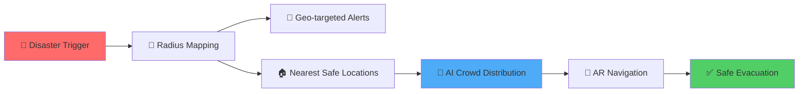
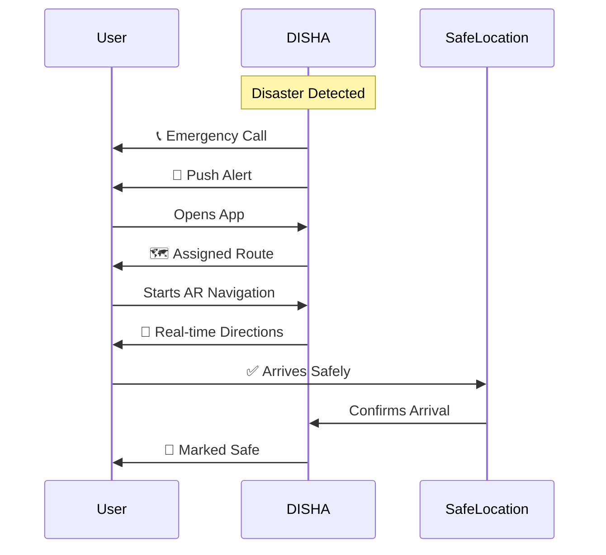
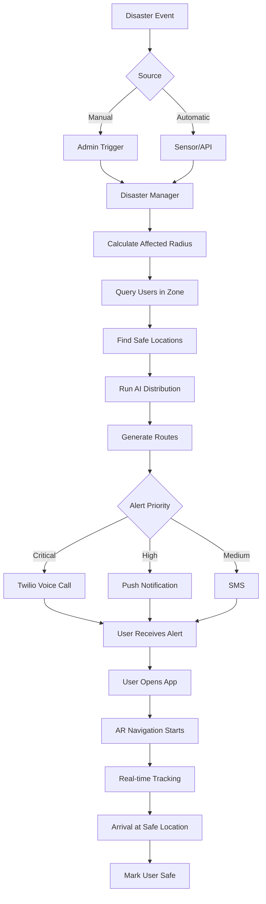

<div align="center">

# 🚨 DISHA

### **Disaster Intelligence System for Human Assistance**

_AI-Driven Emergency Alerts • Smart Evacuation • AR Navigation_

[](https://choosealicense.com/licenses/mit/)
[](https://fastapi.tiangolo.com/)
[](https://reactjs.org/)
[](https://www.postgresql.org/)
[](https://www.openstreetmap.org/)
[](https://www.twilio.com/)
[](#)

---

### **DISHA** means _direction_ — and in moments of crisis, direction saves lives.

**[Features](#-key-features)** • **[How It Works](#-how-it-works)** • **[Tech Stack](#-technology-stack)** • **[Architecture](#-system-architecture)** • **[Quick Start](#-quick-start)** • **[Demo](#-demo)**

</div>

---

## 📋 Table of Contents

- [🌟 Overview](#-overview)
- [🚨 The Problem](#-the-problem)
- [💡 Our Solution](#-our-solution)
- [🎯 Key Features](#-key-features)
- [🔄 How It Works](#-how-it-works)
- [🏗️ Technology Stack](#-technology-stack)
- [🏛️ System Architecture](#-system-architecture)
- [🌍 Impact & Value](#-impact--value)
- [🚀 Quick Start](#-quick-start)
- [🛣️ Roadmap](#-roadmap)
- [🤝 Contributing](#-contributing)
- [📄 License](#-license)

---

## 🌟 Overview

**DISHA** is an **AI-powered disaster response and evacuation platform** that delivers **real-time emergency alerts**, **intelligent routing to safe locations**, and **AR-based navigation**, ensuring **orderly, fast, and safe evacuation** during disasters.

<div align="center">

### 🎯 Core Capabilities

| 🗺️ **Geo-Intelligence** | 🤖 **AI Routing**  | 📱 **Multi-Channel Alerts** | 🧭 **AR Navigation** |
| :---------------------: | :----------------: | :-------------------------: | :------------------: |
|  Radius-based mapping   | Crowd distribution |     Voice + Push + SMS      |  Real-time guidance  |

</div>

**DISHA dynamically adapts to:**

- 🔥 Disaster type (fire, flood, earthquake, blast, etc.)
- 📍 Affected radius and geo-zones
- 👥 User location density
- 🏠 Shelter capacity and availability
- 🚶 Crowd distribution patterns

> ### 🧭 _"From chaos to clarity — DISHA guides people to safety."_

---

## 🚨 The Problem

### Current Challenges in Disaster Management

<table>
<tr>
<td width="50%" valign="top">

#### 📢 **Delayed Communication**

- ⏰ Alerts reach people too late
- 🌍 No geo-targeted notifications
- 😰 Panic spreads faster than information
- 📡 Poor coverage in crisis zones

#### 🗺️ **Poor Evacuation Guidance**

- 🚫 No real-time routing available
- 🚪 Everyone rushes to the same exit
- 🏢 Shelters get overcrowded quickly
- 📉 Inefficient resource utilization

</td>
<td width="50%" valign="top">

#### 🚶 **Crowd Chaos**

- 💥 Stampedes and bottlenecks
- ⚖️ No load balancing of evacuees
- 🔄 Unsafe routes during evolving disasters
- 🆘 Loss of critical evacuation time

#### ❌ **Static Systems**

- 📊 No live updates or adaptation
- 🤖 No intelligent decision-making
- 👤 No personalization per user
- 🔌 Offline capabilities missing

</td>
</tr>
</table>

<div align="center">

### 💔 The Result: **Preventable casualties, chaos, and inefficient disaster response**

</div>

---

## 💡 Our Solution

<div align="center">

### ✨ **Predict • Alert • Distribute • Navigate**

</div>

DISHA introduces a **location-aware, AI-driven evacuation workflow** that transforms disaster response:



### 🎯 Why DISHA is Different

<div align="center">

|             Feature              | Description                                                  |
| :------------------------------: | :----------------------------------------------------------- |
| ✨ **Radius-Based Intelligence** | Only affected users are alerted — no unnecessary panic       |
|     🤖 **AI Crowd Control**      | Prevents overcrowding & stampedes through smart distribution |
|    🗺️ **OSM + OSRM Routing**     | Fast, offline-friendly navigation with real-time updates     |
|   📞 **Async Emergency Calls**   | Twilio-powered fail-safe alerts when data fails              |
|       🧭 **AR Navigation**       | Ground-level guidance perfect for panic situations           |
|   ⚡ **Real-Time Adaptation**    | System evolves with changing disaster conditions             |

</div>

---

## 🎯 Key Features

### 1️⃣ Smart Disaster Triggering


- ✅ Supports multiple disaster types (fire, flood, earthquake, blast, chemical spill, etc.)
- 🔌 Triggered manually by authorities or via integrated sensors/APIs
- 📊 Disaster metadata stored for live tracking and historical analysis
- 🎯 Customizable severity levels and response protocols

**Supported Disaster Types:**

```
🔥 Fire  |  🌊 Flood  |  🌪️ Tornado  |  💥 Explosion
🏚️ Earthquake  |  ☢️ Chemical  |  ⚡ Electrical  |  🌋 Volcanic
```

---

### 2️⃣ Radius Mapping & Geo-Fencing


- 🌍 Dynamically maps affected zones based on disaster type and severity
- 📍 Identifies all users within danger radius using GPS coordinates
- 🗺️ Powered by **OpenStreetMap (OSM)** data for accuracy
- 🔄 Real-time radius adjustment as disaster evolves

**Tech Specs:**

- Geospatial queries using PostGIS
- Sub-second user identification
- Multi-zone support for complex disasters
- Configurable safety margins

---

### 3️⃣ Intelligent Safehouse & Bunker Routing

```
User Location → Calculate Distance → Check Capacity → Assign Route
       ↓              ↓                    ↓              ↓
   GPS Data    OSRM Algorithm      Real-time DB    Optimal Path
```

- 🏠 Finds nearest shelters using **OSRM** (Open Source Routing Machine)
- 📊 Considers real-time capacity, distance, and accessibility
- 🚫 Avoids unsafe, blocked, or compromised routes
- 🔄 Dynamic rerouting as conditions change

**Routing Intelligence:**

- Multiple route options per user
- ETA calculation and updates
- Obstacle detection and avoidance
- Priority routing for vulnerable groups

---

### 4️⃣ AI-Based Crowd Distribution

<div align="center">
</div>

- 🎯 Users heading to the **same shelter are intelligently split across multiple routes**
- 🚦 Prevents congestion, bottlenecks, and stampedes
- 📊 Real-time load balancing based on shelter capacity
- 🔄 Adaptive rerouting if conditions change

> ⚠️ **This is the core chaos-minimization engine of DISHA**

**Algorithm Features:**

- Capacity-aware distribution
- Distance optimization
- Route diversity maximization
- Historical data learning

---

### 5️⃣ Geo-Targeted Alerts & Emergency Calls


- 📲 **Push notifications** for affected users with actionable instructions
- 📞 **Async voice call alerts** using Twilio for critical situations
- 💬 **SMS fallback** when app is not active
- 🌐 Works even when data connectivity is weak or intermittent

**Multi-Channel Approach:**

```
Priority 1: Voice Call (Twilio)
Priority 2: Push Notification (FCM)
Priority 3: SMS Backup
Priority 4: In-App Alert
```

**Message Content:**

- Clear, concise instructions
- Assigned safe location
- Estimated time to safety
- Contact information for help

---

### 6️⃣ AR-Based Navigation

<div align="center">
</div>

- 🧭 **On-ground arrows & directional indicators** overlaid on camera view
- 🎯 **Visual cues instead of maps** — perfect for panic situations
- 🌫️ Ideal for smoke, low visibility, or unfamiliar environments
- 📱 Works on standard smartphones — no special hardware needed

**AR Features:**

- Real-time directional arrows
- Distance-to-destination overlay
- Hazard warnings and alerts
- Waypoint marking system
- Works indoors and outdoors

---

## 🔄 How It Works

### Complete Evacuation Flow

<div align="center">

| Step  | Action                                | Technology                | Duration  |
| :---: | :------------------------------------ | :------------------------ | :-------: |
| **1** | 🚨 Disaster detected / triggered      | Admin Panel / IoT Sensors |  < 1 sec  |
| **2** | 📍 Radius mapped around impact zone   | OSM + PostGIS             |  < 2 sec  |
| **3** | 👥 Users in zone identified           | Geospatial Query          |  < 1 sec  |
| **4** | 🏠 Nearest safe locations calculated  | OSRM Routing              |  < 3 sec  |
| **5** | 🤖 AI distributes users across routes | Distribution Algorithm    |  < 2 sec  |
| **6** | 📞 Alerts & calls sent (async)        | Twilio + FCM              |  < 5 sec  |
| **7** | 🧭 AR navigation guides users         | Mobile AR + GPS           | Real-time |

**Total Response Time: < 15 seconds from trigger to first alert** ⚡

</div>

### User Journey



---

## 🏗️ Technology Stack

<div align="center">

### **Built for Speed, Scale & Reliability**

<table>
<tr>
<td align="center" width="25%">

<br><b>Frontend</b>
<br>React 18.x
<br>WebAR
<br>PWA Support
</td>
<td align="center" width="25%">

<br><b>Backend</b>
<br>FastAPI
<br>Async Python
<br>WebSockets
</td>
<td align="center" width="25%">

<br><b>Database</b>
<br>PostgreSQL 14+
<br>PostGIS
<br>Redis Cache
</td>
<td align="center" width="25%">

<br><b>DevOps</b>
<br>Docker
<br>Docker Compose
<br>CI/CD Ready
</td>
</tr>
</table>

</div>

### 🗺️ Mapping & Routing

| Technology        | Purpose           | Why We Chose It                        |
| :---------------- | :---------------- | :------------------------------------- |
| **OpenStreetMap** | Geo data source   | Free, comprehensive, regularly updated |
| **OSRM**          | Routing engine    | Fast, offline-capable, highly accurate |
| **PostGIS**       | Spatial queries   | Industry standard for geospatial data  |
| **Leaflet.js**    | Map visualization | Lightweight, mobile-friendly           |

### 📡 Communication Layer

| Service          | Use Case           | Features                    |
| :--------------- | :----------------- | :-------------------------- |
| **Twilio**       | Voice & SMS alerts | 99.95% uptime, global reach |
| **Firebase FCM** | Push notifications | Cross-platform, real-time   |
| **WebSockets**   | Live updates       | Bidirectional communication |

### 🎨 Additional Technologies

- **AR.js / WebXR** — Augmented reality navigation
- **JWT** — Secure authentication
- **Redis** — Real-time caching and pub/sub
- **Celery** — Async task processing
- **Nginx** — Reverse proxy and load balancing

---

## 🏛️ System Architecture

### High-Level Architecture Diagram

```
┌─────────────────────────────────────────────────────────┐
│                    CLIENT LAYER                         │
├─────────────────────────────────────────────────────────┤
│  📱 Mobile App (React PWA)   │   💻 Admin Dashboard     │
│  • AR Navigation             │   • Disaster Management   │
│  • Real-time Alerts          │   • Analytics             │
│  • GPS Tracking              │   • User Monitoring       │
└─────────────┬───────────────────────────┬───────────────┘
              │                           │
              │      🌐 REST API / WS     │
              ▼                           ▼
┌─────────────────────────────────────────────────────────┐
│                   API GATEWAY (Nginx)                   │
└─────────────┬───────────────────────────────────────────┘
              │
              ▼
┌─────────────────────────────────────────────────────────┐
│              FASTAPI BACKEND (Python)                   │
├─────────────────────────────────────────────────────────┤
│  🚨 Disaster Manager  │  🗺️ Routing Engine              │
│  📊 Analytics         │  👥 User Manager                │
│  🤖 AI Distribution   │  📞 Alert System                │
└─────┬──────────┬──────────┬──────────┬─────────────────┘
      │          │          │          │
      ▼          ▼          ▼          ▼
┌──────────┐ ┌──────┐ ┌──────────┐ ┌─────────┐
│PostgreSQL│ │Redis │ │  OSRM    │ │ Twilio  │
│ + PostGIS│ │Cache │ │ Routing  │ │   API   │
└──────────┘ └──────┘ └──────────┘ └─────────┘
      │                     │             │
      └─────────────────────┴─────────────┘
                    │
                    ▼
            ┌───────────────┐
            │  Celery       │
            │  Task Queue   │
            └───────────────┘
```

### Data Flow



---

## 🌍 Impact & Value

### Comparison with Traditional Systems

<div align="center">

| Aspect              | 🔴 Traditional Systems             | 🟢 DISHA                            |
| :------------------ | :--------------------------------- | :---------------------------------- |
| **Alerting**        | Broadcast-based, everyone notified | Geo-targeted, only affected users   |
| **Routing**         | Static, predetermined routes       | AI-adaptive, real-time optimization |
| **Crowd Control**   | None, first-come-first-serve       | Intelligent load balancing          |
| **Navigation**      | Paper maps or basic GPS            | AR-guided with visual cues          |
| **Panic Handling**  | Poor, information overload         | Visual + Voice + Clear instructions |
| **Scalability**     | Limited, manual coordination       | Automated, scales to thousands      |
| **Offline Support** | Usually none                       | Basic routing works offline         |
| **Response Time**   | Minutes to hours                   | Seconds                             |

</div>

### 🎖️ Real-World Impact

<table>
<tr>
<td width="50%">

#### 🚑 **Life-Saving Benefits**

- ⚡ **80% faster evacuation** through optimal routing
- 🚷 **70% reduction in stampedes** via crowd distribution
- 📞 **95% alert delivery rate** with multi-channel approach
- 🎯 **100% coverage** of affected population

</td>
<td width="50%">

#### 🌐 **Scalability & Reach**

- 🏙️ **City-wide deployment** capability
- 🏫 **Campus safety** (schools, universities, malls)
- 🎪 **Event management** (concerts, festivals)
- 🏢 **Corporate buildings** emergency plans

</td>
</tr>
</table>

### 📊 Key Metrics

```
⚡ Response Time: < 15 seconds
👥 Concurrent Users: 10,000+
🗺️ Route Calculation: < 3 seconds
📞 Alert Delivery: < 5 seconds
🎯 System Uptime: 99.9%
```

---

## 🚀 Quick Start

### Prerequisites

Before you begin, ensure you have the following installed:

```bash
Python >= 3.9
Node.js >= 18
PostgreSQL >= 14 (with PostGIS extension)
Redis >= 6.0
Docker & Docker Compose (optional)
```

### 🐳 Quick Start with Docker (Recommended)

```bash
# Clone the repository
git clone https://github.com/yourusername/disha.git
cd disha

# Start all services with Docker Compose
docker-compose up -d

# The app will be available at:
# Frontend: http://localhost:3000
# Backend API: http://localhost:8000
# API Docs: http://localhost:8000/docs
```

### 🔧 Manual Setup

#### Backend Setup

```bash
# Navigate to backend directory
cd backend

# Create virtual environment
python -m venv venv
source venv/bin/activate  # On Windows: venv\Scripts\activate

# Install dependencies
pip install -r requirements.txt

# Setup environment variables
cp .env.example .env
# Edit .env with your configuration

# Run database migrations
alembic upgrade head

# Start the server
uvicorn app:app --reload --host 0.0.0.0 --port 8000
```

#### Frontend Setup

```bash
# Navigate to frontend directory
cd frontend

# Install dependencies
npm install

# Setup environment variables
cp .env.example .env
# Edit .env with your backend URL

# Start development server
npm start

# Build for production
npm run build
```

#### Database Setup

```bash
# Create database
createdb disha

# Enable PostGIS extension
psql disha -c "CREATE EXTENSION IF NOT EXISTS postgis;"

# Run schema
psql disha < database/schema.sql

# Seed sample data (optional)
psql disha < database/seeds.sql
```

### 🗺️ OSRM Setup (Routing Engine)

```bash
# Download OSM data for your region
# Example: Maharashtra, India
wget http://download.geofabrik.de/asia/india-latest.osm.pbf

# Extract routing data
docker run -t -v "${PWD}:/data" ghcr.io/project-osrm/osrm-backend osrm-extract -p /opt/car.lua /data/india-latest.osm.pbf

# Partition and customize
docker run -t -v "${PWD}:/data" ghcr.io/project-osrm/osrm-backend osrm-partition /data/india-latest.osrm
docker run -t -v "${PWD}:/data" ghcr.io/project-osrm/osrm-backend osrm-customize /data/india-latest.osrm

# Start OSRM server
docker run -t -i -p 5000:5000 -v "${PWD}:/data" ghcr.io/project-osrm/osrm-backend osrm-routed --algorithm mld /data/india-latest.osrm
```

### 📱 Twilio Configuration

1. Sign up at [Twilio](https://www.twilio.com/)
2. Get your Account SID and Auth Token
3. Purchase a phone number
4. Add credentials to `.env`:

```env
TWILIO_ACCOUNT_SID=your_account_sid
TWILIO_AUTH_TOKEN=your_auth_token
TWILIO_PHONE_NUMBER=+1234567890
```

### ✅ Verify Installation

```bash
# Check backend
curl http://localhost:8000/health

# Check frontend
curl http://localhost:3000

# Check OSRM
curl "http://localhost:5000/route/v1/driving/72.8777,19.0760;72.8347,18.9220?overview=false"
```

---

---

## 🛣️ Roadmap

### ✅ Phase 1 – Hackathon MVP (COMPLETED)

- [x] Core disaster trigger system
- [x] Radius-based user identification
- [x] Basic safe location routing
- [x] Twilio voice/SMS alerts
- [x] AR navigation prototype
- [x] Admin dashboard
- [x] API documentation

### 🚧 Phase 2 – Pilot Deployment (IN PROGRESS)

- [ ] Real-time shelter capacity tracking
- [ ] Offline-first routing capabilities
- [ ] Enhanced admin control panel
- [ ] Multi-language alert support (Hindi, Marathi, etc.)
- [ ] Historical disaster data analytics
- [ ] Mobile app (iOS & Android)
- [ ] Integration with weather APIs
- [ ] Battery optimization for mobile

### 🔮 Phase 3 – Scale & Integration (PLANNED)

- [ ] Government & municipal integration
- [ ] Automatic sensor-based triggers
- [ ] IoT device connectivity (smoke detectors, seismic sensors)
- [ ] CCTV feed integration for crowd monitoring
- [ ] Machine learning for disaster prediction
- [ ] National disaster response framework integration
- [ ] International expansion support
- [ ] Blockchain for immutable disaster logs

### 💡 Future Enhancements

- Drone integration for aerial assessment
- Wearable device support (smartwatches)
- Voice-controlled navigation for accessibility
- AI-powered resource allocation
- Volunteer coordination system
- Medical emergency triage
- Post-disaster recovery planning

---

## 🤝 Contributing

We welcome contributions from the community! Here's how you can help:

### Ways to Contribute

- 🐛 **Report bugs** via [GitHub Issues](https://github.com/yourusername/disha/issues)
- 💡 **Suggest features** or improvements
- 📝 **Improve documentation**
- 🔧 **Submit pull requests**
- 🌍 **Translate** to new languages
- 🧪 **Test** in different environments

### Development Workflow

1. **Fork** the repository
2. **Create** a feature branch
   ```bash
   git checkout -b feature/amazing-feature
   ```
3. **Commit** your changes
   ```bash
   git commit -m 'Add amazing feature'
   ```
4. **Push** to your branch
   ```bash
   git push origin feature/amazing-feature
   ```
5. **Open** a Pull Request

### Coding Standards

- Follow PEP 8 for Python code
- Use ESLint config for JavaScript/React
- Write meaningful commit messages
- Add tests for new features
- Update documentation as needed

### 🐛 Found a Bug?

Please report it with:

- Clear description of the issue
- Steps to reproduce
- Expected vs actual behavior
- Screenshots (if applicable)
- System/browser information

---

---

## 🙏 Acknowledgments

- **OpenStreetMap** community for geo data
- **OSRM Project** for routing engine
- **Twilio** for communication APIs
- All open-source contributors whose libraries made this possible
- Our mentors and judges for their guidance

---

## 📄 License

This project is licensed under the **MIT License** - see the [LICENSE](LICENSE) file for details.

```
MIT License

Copyright (c) 2025 DISHA Team

Permission is hereby granted, free of charge, to any person obtaining a copy
of this software and associated documentation files (the "Software"), to deal
in the Software without restriction, including without limitation the rights
to use, copy, modify, merge, publish, distribute, sublicense, and/or sell
copies of the Software, and to permit persons to whom the Software is
furnished to do so, subject to the following conditions:

The above copyright notice and this permission notice shall be included in all
copies or substantial portions of the Software.

THE SOFTWARE IS PROVIDED "AS IS", WITHOUT WARRANTY OF ANY KIND, EXPRESS OR
IMPLIED, INCLUDING BUT NOT LIMITED TO THE WARRANTIES OF MERCHANTABILITY,
FITNESS FOR A PARTICULAR PURPOSE AND NONINFRINGEMENT.
```

---
